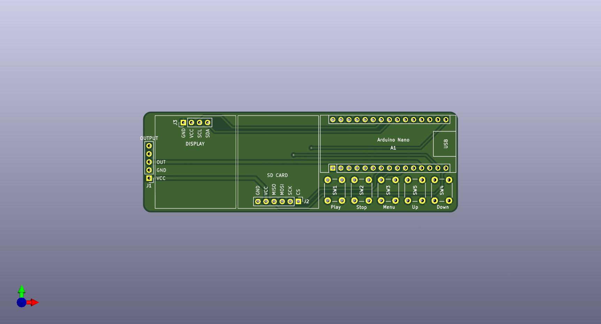
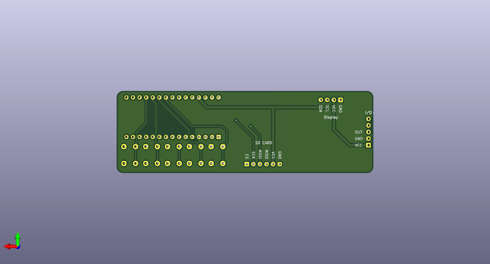

# Very Simple TZXDuino PCB

A very simple, open-source PCB design for the TZXDuino, an Arduino-based ZX Spectrum cassette emulator that plays TZX files from an SD card. This project provides KiCad schematics, PCB layouts, Gerber files, and firmware for easy DIY assembly. No advanced soldering skills required—just basic components like an Arduino Nano, SD module, OLED display, pin headers, and five push buttons.

Perfect for retro computing enthusiasts wanting a compact, reliable TZX player for their ZX Spectrum or ZX Spectrum clones!

## Table of Contents

- [Features](#features)
- [Requirements](#requirements)
- [Build Instructions](#build-instructions)
- [Firmware](#firmware)
- [Schematics & Design Files](#schematics--design-files)
- [Bill of Materials](#bill-of-materials)
- [Usage](#usage)
- [Contributing](#contributing)
- [License](#license)

## Features

- **Compact PCB Design**: PCB is 99mm x 32mm in size.
- **Compatible Firmware**: Supports both the original TZXDuino sketch and enhanced MaxDuino for better playback features.
- **Simple Assembly**: Minimal components; no surface-mount soldering needed.
- **Full Open Source**: KiCad project files, schematics and Gerbers all included—modify and share freely. Firmware is also present here with just a few modifications to suit this PCB.

## Requirements

To build this project, you'll need:

- **Hardware**:
  - Arduino Nano (or compatible clone)
  - MicroSD card module
  - 0.96" OLED display (I2C, SSD1306)
  - 2.54mm pin header (for connections)
  - 5x tactile push buttons (momentary switches)
  - Basic soldering tools, wires, and prototyping breadboard (optional for testing)

- **Software/Tools**:
  - KiCad (for viewing/editing design files)
  - Arduino IDE (for flashing firmware)
  - ZX Spectrum TZX files (load onto SD card)

Total estimated cost: Under $20 excluding tools.

## Build Instructions

1. **Fabricate the PCB**:
   - Use the Gerber files in the [`Gerbers/`](./Gerbers/) folder (or download the ZIP: [`Very_Simple_TZXDuino_KiCad.zip`](./Gerbers/Very_Simple_TZXDuino_KiCad.zip)) to order boards from services like JLCPCB or PCBWay.
   - Alternatively, do it on a perfboard at home if you prefer DIY.

2. **Assemble Components**:
   - Solder the Arduino Nano footprint.
   - Attach the SD module, OLED, pin headers, and push buttons as per the schematic.
   - Refer to the assembly diagram in the PDF (see [Schematics & Design Files](#schematics--design-files)).

3. **Flash Firmware**:
   - See [Firmware](#firmware) section below.

4. **Test**:
   - Insert a FAT32 formatted SD card with TZX files.
   - Power via USB or 5V supply.
   - Use buttons to navigate and play tapes.

## Firmware

This project includes pre-built binaries and source code for [MaxDuino](https://github.com/rcmolina/MaxDuino) but with just a few modifications:

- **MaxDuino**: Enhanced firmware with menu navigation, faster loading, and more features.
  - Source code: [`MaxDuino/`](./MaxDuino/) – Includes `MaxDuino.ino` and supporting files.
  - Pre-built binaries for Arduino Nano: [`MaxDuino/build/`](./MaxDuino/build/)
  - Flash using Arduino IDE: Select "Arduino Nano" board, upload the `.hex` or `.ino` file.

- **Original TZXDuino Sketch**:
  - Download from the [official site](https://arduitape.blogspot.com/).
  - Make sure to change this line `const int chipSelect = 10;` in the sketch with `const int chipSelect = 4;` before flashing.

Both are free and open source. Customize as needed!

## Schematics & Design Files

- **Full KiCad Project**: [`Very_Simple_TZXDuino_KiCad/`](./Very_Simple_TZXDuino_KiCad/) – Includes `Very_Simple_TZXDuino_KiCad.kicad_pro`, `Very_Simple_TZXDuino_KiCad.kicad_sch`, `Very_Simple_TZXDuino_KiCad.kicad_pcb`, and more.
- **Schematic PDF**: [`Documents/Very_Simple_TZXDuino_KiCad.pdf`](./Documents/Very_Simple_TZXDuino_KiCad.pdf) – Printable overview.
- **PCB 3D Renders**: Images in [`Documents/`](./Documents/) for visualization.
- **Gerber Files**: Ready-to-manufacture in [`Gerbers/`](./Gerbers/).

Open in [KiCad](https://www.kicad.org/) for edits.

## Bill of Materials

Interactive BOM (iBOM) generated from KiCad:

- View HTML iBOM: [`BOM/ibom.html`](./BOM/ibom.html)

| Component | Quantity | Description |
|-----------|----------|-------------|
| Arduino Nano | 1 | ATmega328P microcontroller |
| SD Module | 1 | MicroSD card reader
| OLED Display | 1 | 0.96" I2C SSD1306 |
| Pin Header | 1x5 strip | 2.54mm male pins |
| Push Buttons | 5 | Tactile switches (6x6mm) |

## Usage

1. **Prepare SD Card**:
   - Format as FAT16/32.
   - Add TZX files to the root (e.g., `game.tzx`).

2. **Connect to ZX Spectrum**:
   - AUDIO OUT (output) to Spectrum's EAR socket.
   - GND to Spectrum GND.
   - VCC is used to power the PCB from the ZX Spectrum or compatible clone. Do not power it from this pin and the USB port at the same time!

3. **Controls** (via 5 push buttons):
   - Button 1: Play/OK
   - Button 2: Stop/Back
   - Button 3: Menu
   - Button 4: Up
   - Button 5: Down

Power on, select a file via OLED menu, and play! Outputs digital audio signal mimicking a cassette tape.

For troubleshooting: Check connections with a multimeter; ensure firmware matches your sketch choice.

## Contributing

Contributions welcome! Whether it's KiCad improvements, new firmware features, or assembly tips:

1. Fork the repo.
2. Create a feature branch (`git checkout -b feature/YourFeature`).
3. Commit changes (`git commit -m 'Add YourFeature'`).
4. Push to branch (`git push origin feature/YourFeature`).
5. Open a Pull Request.

Please include details on hardware changes.

## License

This project is licensed under the MIT License - see the [LICENSE](LICENSE) file for details. All files (KiCad, firmware, docs) are free for personal/commercial use—attribute if sharing derivatives.

Project Link: [https://github.com/r0b0t1cu/Very-Simple-TZXDuino-PCB](https://github.com/r0b0t1cu/Very-Simple-TZXDuino-PCB)
